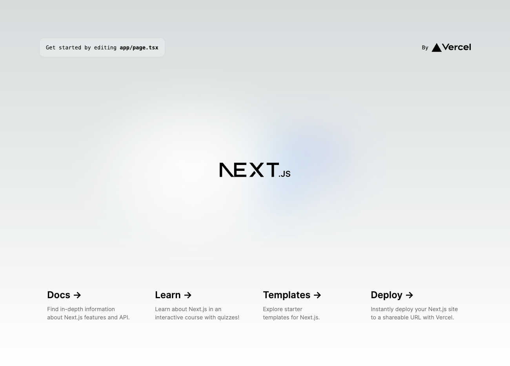

# nextjs-lambda-app
This is a sample project with `Next.js` + `AWS Lambda`.

## Run locally
First, install the dependent packages.

```bash
$ yarn
yarn install v1.22.21
[1/4] 🔍  Resolving packages...
[2/4] 🚚  Fetching packages...
warning Pattern ["string-width@^4.1.0"] is trying to unpack in the same destination "/Users/motohiro/Library/Caches/Yarn/v6/npm-string-width-cjs-4.2.3-269c7117d27b05ad2e536830a8ec895ef9c6d010-integrity/node_modules/string-width-cjs" as pattern ["string-width-cjs@npm:string-width@^4.2.0"]. This could result in non-deterministic behavior, skipping.
[3/4] 🔗  Linking dependencies...
[4/4] 🔨  Building fresh packages...
✨  Done in 2.14s.
```

All you have to do is launch the application.

```bash
$ yarn dev
yarn run v1.22.21
$ next dev
   ▲ Next.js 14.1.0
   - Local:        http://localhost:3000

 ✓ Ready in 2.7s
 ○ Compiling / ...
 ✓ Compiled / in 1928ms (522 modules)
```

## Deploy to AWS
Install `AWS SAM CLI` in advance by referring to the following link.

- [Installing the AWS SAM CLI - AWS Serverless Application Model](https://docs.aws.amazon.com/serverless-application-model/latest/developerguide/install-sam-cli.html)

The first time you deploy, `sam deploy` with the `-guided` option.

```bash
$ sam deploy --guided --profile=${AWS_PROFILE}
```

You will then be asked a few questions, which I will answer as follows.

```bash
Configuring SAM deploy
======================

        Looking for config file [samconfig.toml] :  Found
        Reading default arguments  :  Success

        Setting default arguments for 'sam deploy'
        =========================================
        Stack Name [nextjs-lambda-app]: 
        AWS Region [{AWS_REGION}]: 
        Parameter StackFamily [nextjs-lambda-app]: 
        #Shows you resources changes to be deployed and require a 'Y' to initiate deploy
        Confirm changes before deploy [Y/n]: 
        #SAM needs permission to be able to create roles to connect to the resources in your template
        Allow SAM CLI IAM role creation [Y/n]: 
        #Preserves the state of previously provisioned resources when an operation fails
        Disable rollback [y/N]: 
        NextFunction Function Url may not have authorization defined, Is this okay? [y/N]: y
        Save arguments to configuration file [Y/n]: 
        SAM configuration file [samconfig.toml]: 
        SAM configuration environment [default]: 
```

After the build and deployment preparations are successfully completed, you will be asked to start deployment as shown below.

```bash
Previewing CloudFormation changeset before deployment
======================================================
Deploy this changeset? [y/N]: 
```

Enter `y` to start deployment.

Then, when deployment is complete, the Lambda URL will be output as shown below, which can be accessed.

```bash
CloudFormation outputs from deployed stack
------------------------------------------------------------------------------------------------------------------------------------------------------------------------------------------------------------------------------------------------
Outputs                                                                                                                                                                                                                                        
------------------------------------------------------------------------------------------------------------------------------------------------------------------------------------------------------------------------------------------------
Key                 EcrFrontend                                                                                                                                                                                                                
Description         -                                                                                                                                                                                                                          
Value               nextjs-lambda-app/frontend                                                                                                                                                                                                 

Key                 NextFunctionUrl                                                                                                                                                                                                            
Description         -                                                                                                                                                                                                                          
Value               https://{LAMBDA_URL_ID}.lambda-url.{AWS_REGION}.on.aws/                                                                                                                                                 

Key                 NextFunction                                                                                                                                                                                                               
Description         -                                                                                                                                                                                                                          
Value               arn:aws:lambda:{AWS_REGION}:{AWS_ACCOUNT_ID}:function:nextjs-lambda-app-NextFunction-{FUNCTION_ID}                                                                                                                            
------------------------------------------------------------------------------------------------------------------------------------------------------------------------------------------------------------------------------------------------


Successfully created/updated stack - nextjs-lambda-app in {AWS_REGION}
```

The top page should appear as shown below.


